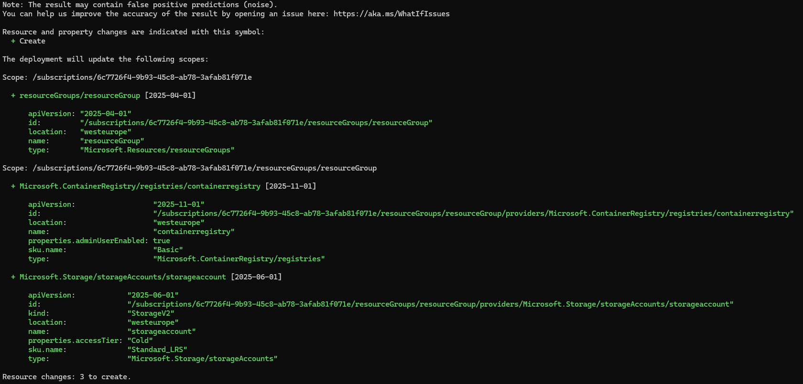

# Projekt: Flask + Nginx + PostgreSQL w Dockerze z Azure IaC

## Opis projektu
Celem projektu jest stworzenie kompletnego środowiska dla aplikacji webowej **Flask + Nginx + PostgreSQL**, które:
- Działa całkowicie w **Dockerze** (backend, frontend, baza danych, migracje, seedowanie, testy),
- Używa **Azure** wyłącznie jako minimalnego IaC (Resource Group + ACR),
- Korzysta z **wielostopniowego Dockerfile** (builder → test → final),
- Wykorzystuje **Docker Compose** do uruchamiania wszystkich elementów,
- Posiada **dedykowane sieci i wolumeny Dockerowe**,
- Implementuje **seedowanie bazy w osobnym kontenerze**,
- Zawiera **pipeline CI/CD w GitHub Actions**.

Poniżej znajduje się działanie komendy:

```
az deployment sub what-if \
    --location westeurope \
    --template-file main.bicep \
    --parameters parameters.json
```


